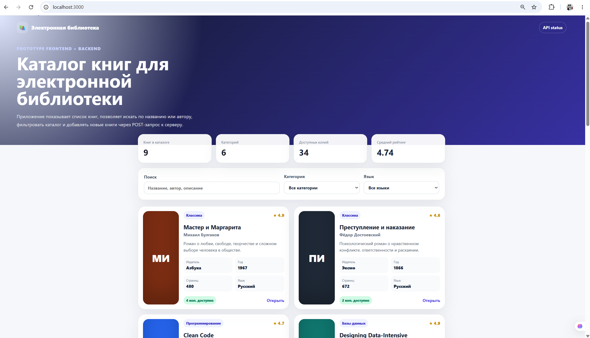

# Электронная библиотека

Прототип приложения электронной библиотеки: **frontend на Vite + Vue** и **backend на FastAPI**.  
Приложение позволяет просматривать каталог книг, искать книги, фильтровать по категории/языку и добавлять новую книгу через POST-запрос.

## Скриншот запущенного приложения



## Стек технологий

- Frontend: Vite, Vue 3, JavaScript, CSS
- Backend: FastAPI, Python, Pydantic
- Контейнеризация: Docker, Docker Compose, Nginx
- Данные: моковые данные, созданные в backend-части

## Структура проекта

```text
electronic-library/
├── backend/
│   ├── app/
│   │   ├── data.py
│   │   ├── main.py
│   │   └── models.py
│   ├── Dockerfile
│   └── requirements.txt
├── frontend/
│   ├── src/
│   │   ├── api/
│   │   ├── components/
│   │   ├── App.vue
│   │   ├── main.js
│   │   └── style.css
│   ├── Dockerfile
│   ├── index.html
│   ├── nginx.conf
│   ├── package.json
│   └── vite.config.js
├── docs/
│   └── imgs/
│       └── app-screenshot.png
├── docker-compose.yml
└── README.md
```

## Запуск backend

```bash
cd backend
python -m venv .venv
```

Windows:

```bash
.venv\Scripts\activate
```

Установка зависимостей и запуск сервера:

```bash
pip install -r requirements.txt
uvicorn app.main:app --reload --host 0.0.0.0 --port 8000
```

Backend будет доступен по адресу:

```text
http://localhost:8000
```

Документация API:

```text
http://localhost:8000/docs
```

## Запуск frontend

В отдельном терминале:

```bash
cd frontend
npm install
npm run dev
```

Frontend будет доступен по адресу:

```text
http://localhost:3000
```

## Сборка frontend

```bash
cd frontend
npm run build
```

После сборки готовые статические файлы появятся в папке `frontend/dist`.

## Запуск через Docker Compose

Из корневой папки проекта:

```bash
docker compose up --build
```

После запуска:

```text
Frontend: http://localhost:3000
Backend:  http://localhost:8000
API docs: http://localhost:8000/docs
```

## Основные API routes

| Метод | Route | Назначение |
|---|---|---|
| GET | `/api/health` | Проверка работы backend |
| GET | `/api/books` | Получить список книг |
| GET | `/api/books/{book_id}` | Получить одну книгу по id |
| POST | `/api/books` | Добавить новую книгу |
| GET | `/api/categories` | Получить список категорий |
| GET | `/api/languages` | Получить список языков |
| GET | `/api/stats` | Получить статистику библиотеки |

## Пример POST-запроса

```json
{
  "title": "Новая книга",
  "authors": ["Имя Автора"],
  "description": "Краткое описание книги для каталога электронной библиотеки.",
  "publisher": "Учебное издательство",
  "year": 2026,
  "pages": 240,
  "isbn": "978-0000000000",
  "language": "Русский",
  "category": "Учебная литература",
  "cover_color": "#4f46e5",
  "available_copies": 3,
  "rating": 4.5,
  "read_url": "https://openlibrary.org/"
}
```

## Что реализовано по заданию

- Создан frontend-проект на Vite.
- Настроена сборка через `npm run build`.
- Frontend запускается локально через `npm run dev`.
- Добавлен Dockerfile для frontend и Nginx-конфигурация.
- Реализован backend-сервер на FastAPI.
- Есть несколько routes, включая GET и POST.
- Используются моковые данные книг.
- Скриншот приложения находится в папке `docs/imgs`.
- Добавлен общий запуск через `docker compose up --build`.

